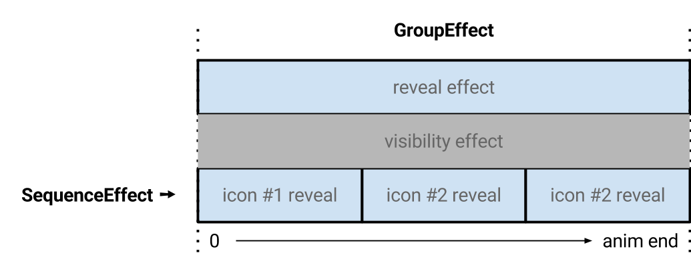

## Step 5: Fading it all in

The effect we've generated looks cool, but it has a clear issue - the icons being displayed are immediately visible, while the effect has a short duration.

Instead of showing each icon immediately, let's fade them in over time. The top icon can fade immediately, followed by the next icon, and so on. We can achieve this using a `SequenceEffect` (so each icon reveals after each other), and our existing `GroupEffect`. The layout of our animations will look a bit like this-



Since we've already done some groundwork for our groups and player, this step will be pretty simple. Let's get started!

### Icon Effects

Let's create an array of effects for each one of our icons. Above our current `GroupEffect` code in `site.js`, add these lines to create a single `SequenceEffect`-

```js
  var icons = Array.prototype.slice.call(popup.querySelectorAll('.ball'));
  var iconEffect = new SequenceEffect(icons.map(function(icon) {
    var effect = [{opacity: 0}, {opacity: 1}];
    var timing = {duration: rect.height * 2 / icons.length, fill: 'backwards'};
    return new KeyframeEffect(icon, effect, timing);
  }));
```

Each animation is basically the same, with a duration relative to the total duration of the outer animation (which was `rect.height * 2`).

Note that we set these animations to `fill: 'backwards'`, which means that *before* they start playing, their value will be set. This is important as each icon fades in one at a time, and they should be transparent before that happens.

### Combining it all together

Next, add the effect to the `GroupEffect` constructor-

```js
  var groupEffect = new GroupEffect([fillEffect, popupEffect, iconEffect]);
```

And we're almost done. The next change is very important, but a complex concept to explain. Because we have animations that `fill: 'backwards'`, and our animation is transient and finishes at the *start* of the animation, we should make sure the effects we specify don't apply forever.

This is simple to avoid. Let's modify the same line to specify that the group should only `fill: 'forwards'` (by default, groups or sequences fill in both directions), so that when our popup is open, all effects are still applied-

```js
  var groupEffect = new GroupEffect([fillEffect, popupEffect, iconEffect], {fill: 'forwards'});
```

Without this change, the icons would be permanently held at `opacity: 0`. This would be the case even as combined with further openings of the popup (aka, future animations). This leaks memory and causes the animations to interact badly together.

## Done

You're all done! The final version of the site is located in `iconpopups/final`.

**Our conclusion is in [Step 6: Congratulations! &raquo](step6.md)**